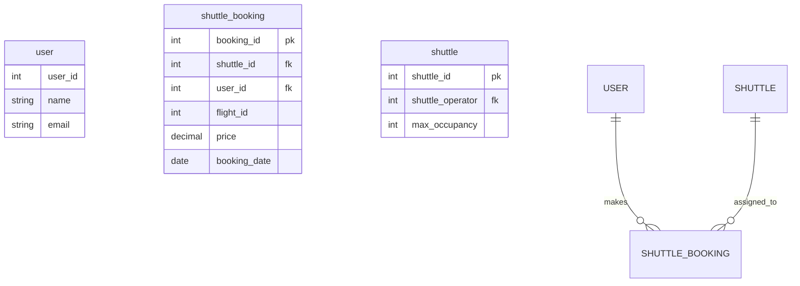

```mermaid
erDiagram
    user {
        int user_id
        string name
        string email
    }

    shuttle_booking {
        int booking_id pk
        int shuttle_id fk
        int user_id fk
        int flight_id
        decimal price
        date booking_date
    }

    shuttle {
      int shuttle_id pk
      int shuttle_operator fk
      int max_occupancy
    }

    USER ||--o{ SHUTTLE_BOOKING : makes
    SHUTTLE ||--o{ SHUTTLE_BOOKING : assigned_to

```
