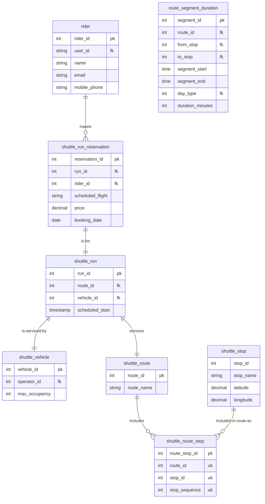

```mermaid
erDiagram
    rider {
        int rider_id pk
        string user_id fk
        string name
        string email
        string mobile_phone
    }

    shuttle_run_reservation {
        int reservation_id pk
        int run_id fk
        int rider_id fk
        string scheduled_flight
        decimal price 
        date booking_date 
    }

    shuttle_run {
        int run_id pk
        int route_id fk
        int vehicle_id fk
        timestamp scheduled_start
    }

    shuttle_vehicle {
      int vehicle_id pk
      int operator_id fk
      int max_occupancy
    }

    shuttle_route {
        int route_id pk
        string route_name 
    }

    shuttle_stop {
        int stop_id
        string stop_name
        decimal latitude
        decimal longitude
    }
    
    shuttle_route_stop {
        int route_stop_id pk
        int route_id uk
        int stop_id uk
        int stop_sequence uk
    }

    route_segment_duration {
        int segment_id pk
        int route_id fk
        int from_stop fk
        int to_stop fk
        time segment_start
        time segment_end
        int day_type fk
        int duration_minutes
    }

    rider ||--o{ shuttle_run_reservation : makes
    shuttle_run_reservation ||--|| shuttle_run : is-for
    shuttle_run ||--|| shuttle_route : services
    shuttle_run ||--|| shuttle_vehicle : is-serviced-by
    shuttle_route ||--o{ shuttle_route_stop : includes
    shuttle_stop ||--o{ shuttle_route_stop : included-in-route-as

```
