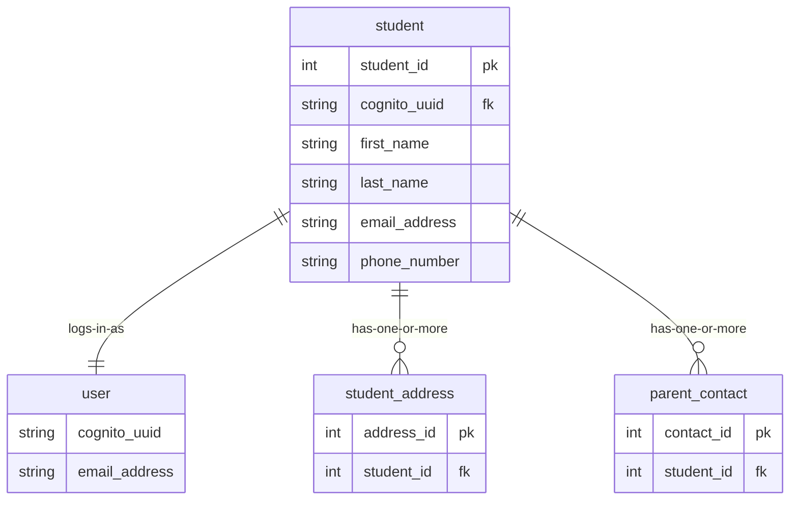

# Student Service - Entity Relationship Diagram (ERD)

```mermaid
erDiagram

    user {
      string cognito_uuid
      string email_address
    }

    student {
        int student_id pk
        string cognito_uuid fk
        string first_name
        string last_name
        string email_address
        string phone_number
    }

    student_address {
        int address_id pk
        int student_id fk
    }

    parent_contact {
        int contact_id pk
        int student_id fk
    }

    student ||--|| user : logs-in-as
    student ||--o{ student_address : has-one-or-more
    student ||--o{ parent_contact : has-one-or-more

```
